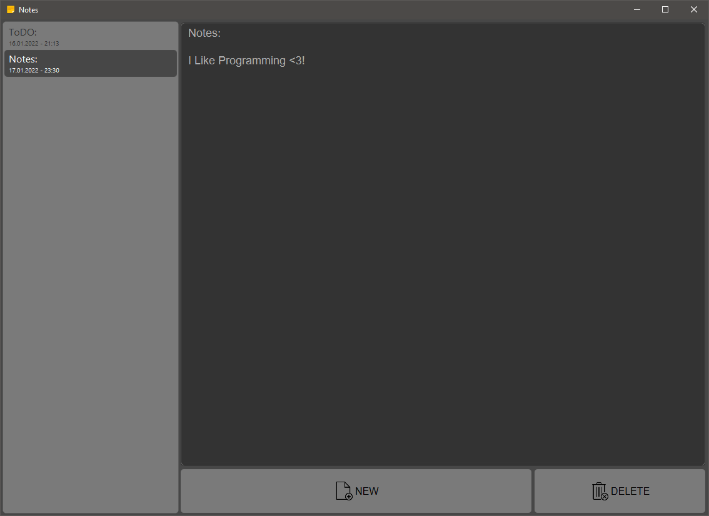

# 🗒️ NotesApp

simple notes-application programmed with JavaFX.

### Screenshot:

### 🚀 TODO:
- [x] show creationdate in listview
- [ ] maybe add tags?
- [ ] adding about section

### 💡 What I learned:
- JavaFX
- create custom ListCell
- using SceneBuilder
- using IntelliJ Idea
- gradle
- Sqlite

